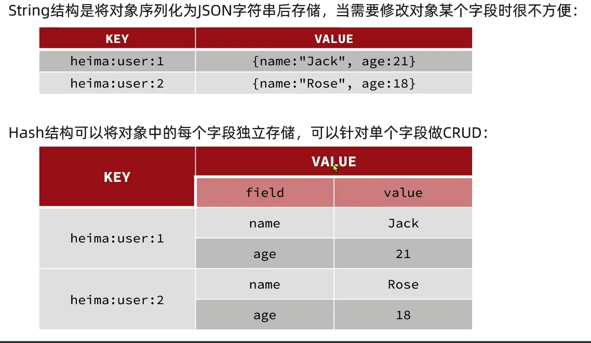
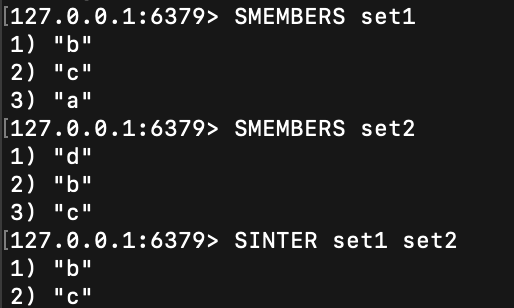

## 1. 基础配置文件（redis.conf）

```properties
# 允许访问的地址，默认是127.0.0.1，会导致只能在本地访问。修改为0.0.0.0则可以在任意IP访问，生产环境不要设置为0.0.0.0
bind 0.0.0.0
# 守护进程，修改为yes后即可后台运行
daemonize yes 
# 密码，设置后访问Redis必须输入密码
requirepass 123321
```

## 2. Redis命令

### 2.0 基础知识

#### key的结构

如果在一个项目中，用户和产品都有id，需要通过多个单词形成层级结构进行区分（文件夹），使用冒号隔开，项目名：类型：id

例如

```bash
JD:user:1 #代表id为1的用户
JD:Product:1 #代表id为1的产品
```


#### 不同类型的差别

在Redis中，不同类型指的是在Value字段中值的不同。

### 2.1 通用命令

#### KEYS

作用：	在当前的数据库中搜索**键名**

用法：	keys [key_name]

返回值：	返回符合条件的所有键名；

​				如果不存在，则返回（empty array）

```bash
keys * #搜索所有的键
keys a* #搜索所有以a开头的键
keys a? #搜索所有以a开头的二字键
```

在实际生产环境中不建议使用，因为keys属于模糊搜索 对于单线程的Redis消耗很大，造成堵塞。


####	DEL

作用：	删除指定的键值对

用法：	del [key_name]

返回值：	返回删除成功的键值对个数（int型），删除失败返回0


#### EXISTS

作用：	判断指定的键名是否存在

用法：	exists [key_name]

返回值：存在则返回1，不存在返回0


#### EXPIRE

作用：	给一个key设置有效期，到期时自动删除该key

用法：	EXPIRE key seconds

返回值：成功返回1，失败返回0 

Redis是一个存储在内存中的数据库，使用临时的数据可以减少内存的负担，例如验证码的五分钟有效期，查找有效期的命令为[TTL](# TTL)

#### TTL

作用：	Time To Live 查询一个key的生存时间

用法：	TTL key

返回值：返回当前key的有效时间，单位是秒；

​				如果没有设置有效期，返回-1；

​				如果已经过期，返回-2.


### 2.2 String类型的命令

#### SET

作用：	向数据库中添加或修改一个键值对

用法：	SET key1 value1  [过期时间|....]

返回值：添加成功返回OK

#### GET

作用：	根据一个key取一个值

用法：	GET key1

返回值：返回内容，如果不存在 返回nil


#### MSET

Multiple SET 批量添加

#### MGET

批量获取

#### INCR

作用：	让一个整形的key自增1

用法：	INCR key

返回值：返回增1后的值，如果不存在或者非整数类型，会报错


#### INCRBY

作用：	根据指定的步长自增

用法：	INCRBY key 2

返回值：返回类型同INCR

#### INCRBYFLOAT

作用：	浮点类型的数字自增，且**必须声明步长**

#### SETNX

作用：	添加一个String类型的键值对，**前提是该key不存在**

用法：	同set

返回值： 添加成功，返回1；添加失败返回0

#### SETEX

作用：	添加一个String类型的键值对，同时提供过期时间

用法：	同set

返回值： 添加成功，返回OK；

### 2.3 Hash类型(H)的命令

Hash类型，即散列，其值是一个无序字典。

哈希型命令在String类型命令的基础上，增加的field字段，



变成为**“Key-field-value“**格式


#### HSET

作用：	向数据库中添加或修改一个键值对

用法：	SET key1 field1 value1  [过期时间|....]

返回值：添加成功返回1


#### HGET

作用：	向数据库中添加或修改一个键值对

用法：	SET key1 field1 value1  [过期时间|....]

返回值：添加成功返回1


#### HMSET

#### HMSET

#### HGETALL

作用：	获取一个hash类型的key中所有的field和value值

用法：	HGETALL key1

返回值：返回所有的key和value


#### HKEYS

#### HVALS

作用：	获取所有的键和值

用法：	HKEYS（HVALS） key1

返回值：


#### HINCRYBY

作用：	获取所有的键和值

用法：	HINCRYBY key1 field1 int

返回值：自增后的值


#### HSECTNX

作用：	如果该字段存在，则添加

用法：	HSECTNX key1 field1

返回值：

### 2.4 List类型(L/R)的命令

Redis中List类型与Java的LinkedList类似，可以看做是一个双向链表的结构。支持**双向检索**，有下面特征：

* 有序
* 元素可重复
* 插入和删除快
* 查询速度一般（只能通过逐个遍历的方式进行查询）

例如：朋友圈点赞，评论等具有一定顺序的数据

 #### LPUSH/RPUSH

作用：	LPUSH：从左侧添加一个元素

用法：	LPUSH key1 value1 [value2...]

返回值：返回当前key所有的value数量


​							3-2-1

#### LPOP/RPOP

作用：	LPOP，从左侧POP多个数据

用法：	LPOP key1 counts

返回值：返回POP出的数据


#### LRANGE

作用：	返回一定范围内所有的value（下标从0开始）

用法：	LRANGE key start end 


#### BLPOP/BRPOP

作用：	B=block，阻塞，pop出一侧的元素，如果没有元素可以pop，则等待指定的时间

用法：	BLPOP key timeout


### 2.5 Set类型(S)的命令

Redis的Set结构与Java的HashSet类似，可以看做是一个value为nil的HashMap，具有如下特征：

* 无序
* **元素不可重复**（区别于List）
* 查找快
* 支持交集，并集，差集等功能

#### SADD

作用：	向set中添加一个或者多个元素

用法：	SADD key member

#### SREM

作用：	移除set中的指定元素

用法：	SREM key member

#### SCARD

作用：	返回set中元素的个数

用法：	SCARD key

#### SISMEMBER

作用：	判断一个元素是否存在于key中

用法：	SISMEMBER key member

#### SMEMBERS

作用：	返回key中所有的元素

用法：	SMEMBERS key


#### SINTER 

作用：	多个集合交集运算

用法：	SINTER key1 key2 

返回值：返回交集的元素



#### SDIFF 

作用：	多个集合差集运算

用法：	SDIFF key1 key2  (key1 -key2）

返回值：返回元素


#### SUNION

作用：	多个集合并集运算

用法：	SUNION key1 key2  (key1 -key2）

返回值：返回元素


#### Set命令的练习


```bash
#	添加好友命令
sadd zhangsan lisi wangwu zhaoliu
(integer) 3
sadd lisi wangwu mazi ergou
(integer) 3
#	计算张三好友数量
127.0.0.1:6379> scard zhangsan
(integer) 3
# 输出张三和李四有哪些共同好友
127.0.0.1:6379> SINTER zhangsan lisi 
1) "wangwu"
#	查询那些人是张三但不是李四的好友
127.0.0.1:6379> SDIFF zhangsan lisi 
1) "zhaoliu"
2) "lisi"
```

### 2.6 SortedSet类型(Z)的命令

Redis 的SortedSet是一个可排序的Set集合，与ava中的TreeSet有些类似,但底层数据结构却差别很大。

Sortedset中的每一个元素都带有一个**score** 属性，基于score 属性对元素排序。

底层的实现是一个跳表(SkipList )加hash表。 SortedSet 具备下列特性：

* 可排序
* 元素不可重复
* 查询速度快

常见的地方：排行榜

#### ZADD  

作用：	添加一个带有score的元素

用法：	 ZADD key score member

#### ZREM

作用：	删除元素

#### ZSCORE

作用：	查询元素的score

用法：	 ZSCORE key  member

#### ZRANK

作用：	查询元素的排名

用法：	 ZRANK key  member

#### ZCARD

作用：	查询元素的个数

#### ZCOUNT

作用：	计算指定score范围内所有元素的**个数**

用法：	ZCOUNT key min max

#### ZRANGE

作用：	获取指定**排名**范围内所有元素

用法：	ZRANGE key min max

#### ZRANGEBYSCORE

作用：	获取指定**score**范围内所有元素

用法：	ZRANGEBYSCORE key min max

#### ZINCRBY

#### ZDIFF,ZINTER,ZUNION


注意所有排名默认都是升序的，如果需要降序需要在Z后面添加**REV**，例如ZREVRANGE

#### SortedSet命令练习


```bash
#	添加分数信息
127.0.0.1:6379> ZADD SS 89 Lucy 82 Rose 95 Tom 78 Jerry 92 Amy 76 Miles
(integer) 6
```


```bash
#	删除Tom同学
127.0.0.1:6379> ZREM SS Tom
(integer) 1
#	获取Amy同学的分数
127.0.0.1:6379> ZSCORE SS Amy
"92"
# 获取Rose同学的排名
127.0.0.1:6379> ZREVRANK SS Rose
(integer) 3 #	此时应该+1 因为下标是从0开始计算的
#	查询80分以下的学生数量
127.0.0.1:6379> ZCOUNT SS 0 80
(integer) 2
#	给Amy同学加2分
127.0.0.1:6379> ZINCRBY SS 2 Amy
"94"
# 查询成绩前3的学生
127.0.0.1:6379> ZREVRANGE SS 0 2
1) "Amy"
2) "Lucy"
3) "jack"
# 查询80分以下的学生
127.0.0.1:6379> ZRANGEBYSCORE SS 0 80
1) "Miles"
2) "Jerry"
```


